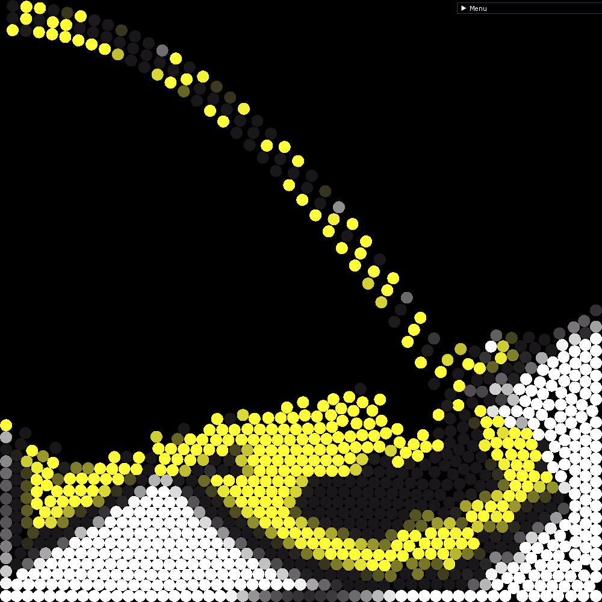
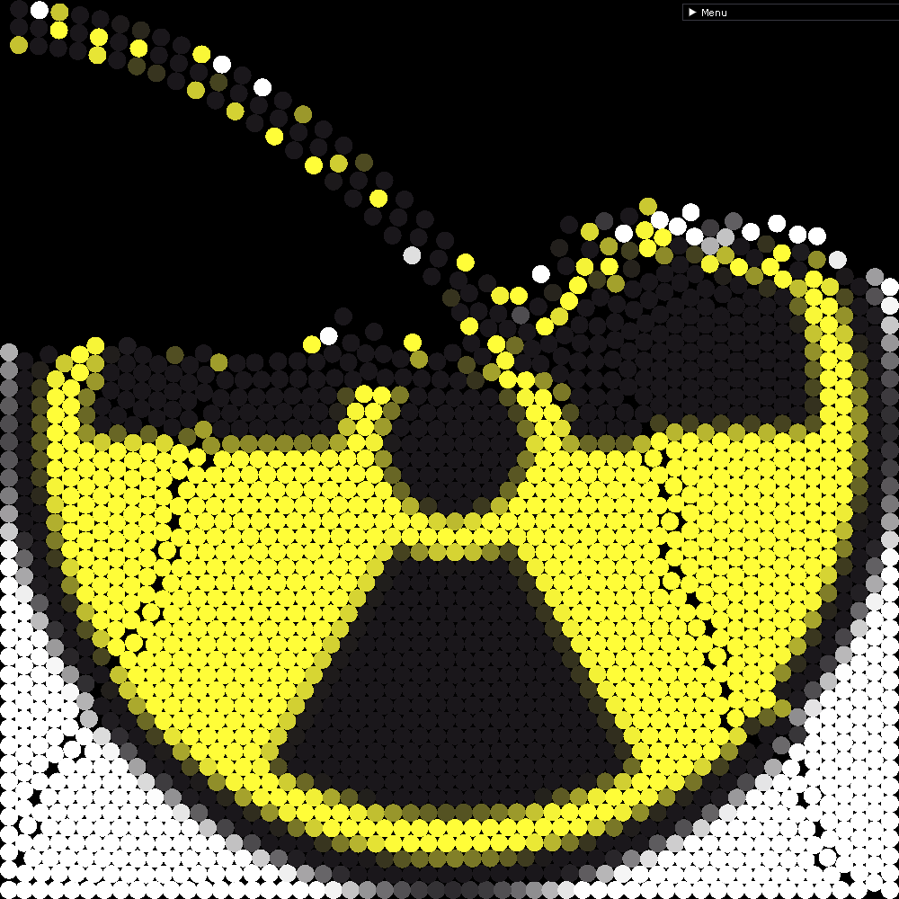
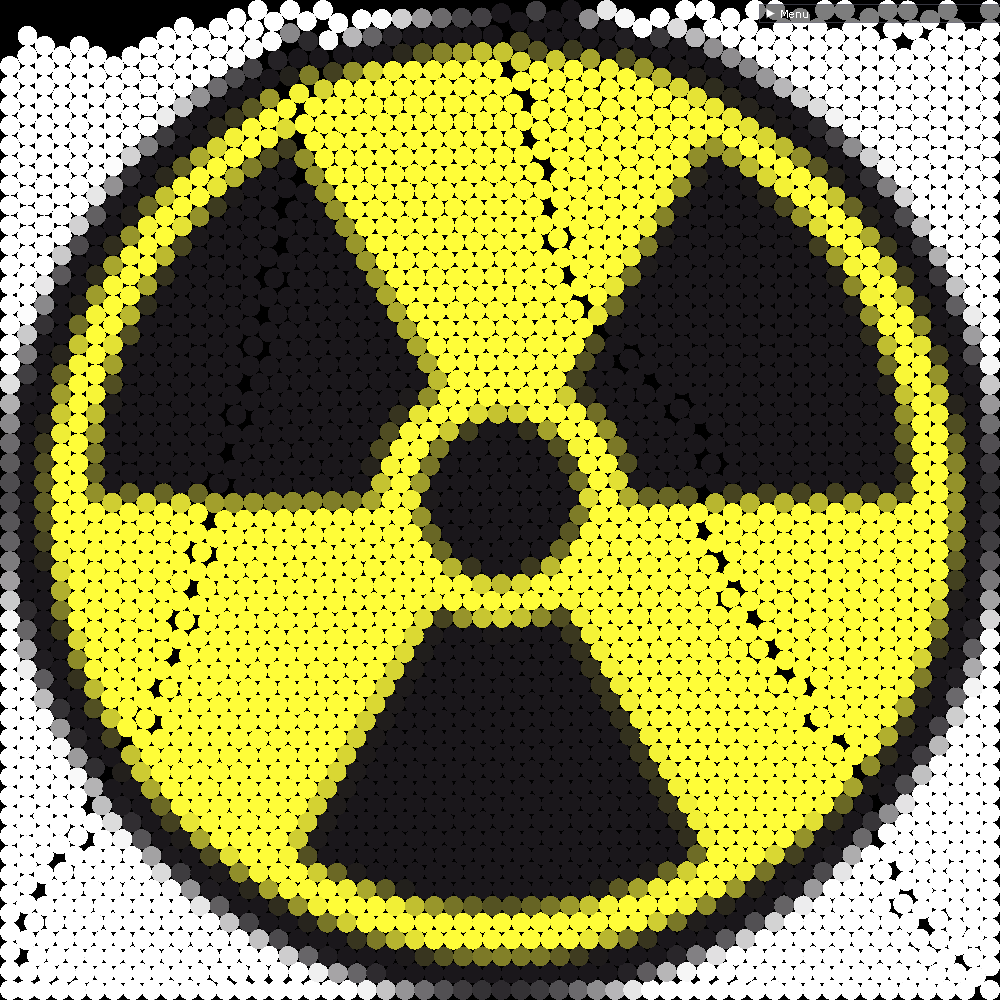

# VerletParticles

## Very simple particle physics simulation, with image rendering

Inspiration: https://youtu.be/lS_qeBy3aQI

Example:

  
   
  

*******
 1. [Installing](#Installing)
 2. [Compiling/Running](#Compiling/Running)
 3. [Create your own animation](#Create_your_own_animation)
 3. [Current state](#Current_state)
 4. [Limitations](#Limitations)
 5. [Documentation](#Documentation)
*******

## Installing

Currently make install has not been implemented

Download source code **recursivelly**, i.e. `git clone git@github.com:IVSOP/VerletParticles.git --recursive`

*******

## Compiling/Running

   ### Dependendies
   * CMake

   ### Compiling and Running
   * Use the script `run.sh` to compile and run
   * For now, image is not passed as argument but its path is used in main, near sandboxes and spawners

*******

## Create your own animation

To explain this, I should start by explaining what's happening in main.cpp:

A sandbox and renderer are created, with 1000x1000 pixel size and 5000 max particles. (They can each have their own pixel values for some reason)

I then create spawnerInfo instances, which are structs used to pass information to the spawners

Spawners are then created, with a start tick, end tick, spawn function and the information: they will spawn particles between start tick and end tick,
calling their spawn function with the information specified. See the functions already used for examples

The simulation is then performed for a given number of ticks, and then the image is calculated from the resulting particle positions

After setting the color information in spawner info structs, the normal render loop is started

To customize animations, you can change/make your own:

* Spawn functions (see the ones already made, they have a janky implementation for now)
* Spawner information
* Number of ticks simulation runs for
* Change image path (see [Limitations](#Limitations))

*******

## Current state

This is a personal project I created to learn OpenGL and physics simulations. It is coded in C++ and simulates particle movement using Verlet integration.

It can now render an image from particles, but is still very limited.

Working algorithms:
* grid (GridSandbox)

Stopped working due to some changes, will fix in the future
* brute force (RegularSandbox)
* sorting (SortedSandbox)
* quad tree (QuadTreeSandbox)

Algorithms being worked on:
* quad tree array (quad tree is allocated as an array)

The constraint is currently a square but there is also a circle constraint, commented out in Sandbox.cpp onUpdate()

*******

## Limitations

Algorith limitations:
* grid -> Particles must be of the same size. Please use GRID_PARTICLE_SIZE in GridSandbox.h
* brute force -> Very slow
* sorting -> Has a chance of glitching when particles have different sizes
* quad tree -> Glitches when particles collide near quadrant borders (which happens a lot)

For now there is no SIMD, gpu calculations, etc. Multi-threading will be implemented in the future.

The simulation is working fine with a squared space, however "rectangular" space is not good

If you decide tu use a non-squared image for a squared simulation space, the image will not automatically be
resized or reshaped, it will work but the image used for the simulation is either just a squared cutout of the real image
or will have useless filler pixels

*******

## Documentation

What?
